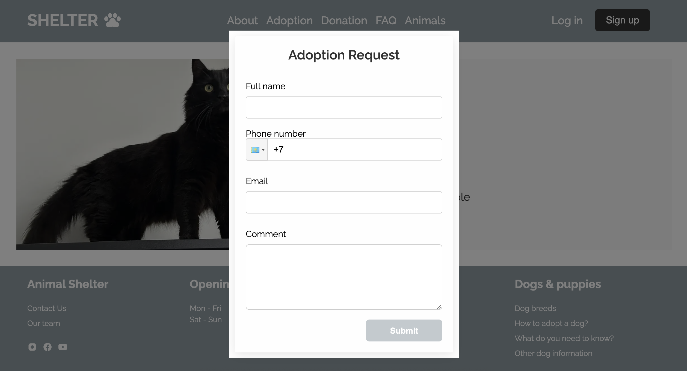

# Animal Shelter

## Demo Video

## Overview

This is a web application built with **Next.js**, designed as a social project to support animal shelters and address the issue of abandoned pets.

## Goal

Its primary goal is to help animals find a new home and owners, while also easing the financial burden on shelters and potentially reducing government spending on animal control.

Beyond direct adoptions, the platform also serves to raise public awareness, encouraging people to be more responsible and informed about animal welfare.

By providing an accessible online space, it creates a bridge between shelters and the community, promoting compassion, responsibility, and long-term support for animals in need.

## Tech Stack

- **Framework:** Next.js (React)
- **Database:** better-sqlite3
- **Authentication:** Lucia (cookie-based sessions)
- **Password Hashing:** bcryptjs
- **Styling:** CSS Modules
- **Routing:** File-based routing (`/app/page.js`)

## Key Features

- **Animal Page** – all users can browse the full list of animals, view individual animal detail pages, and select a pet they are interested in.
- **Adoption Requests** – unregistered users can "reserve" an animal by submitting a request form with their name, email, phone number, and other info.
- **Admin Panel** – animal shelters can register, authenticate, and access an administrative dashboard. From there, they can:
    * View all incoming requests in chronological order with full user details.
    * Assign a status to each request: _pending_, _fulfilled_, or _rejected_.
    * Filter requests by status to manage large volumes more efficiently.
    * Add new animal cards to the listing.
    * Edit or delete existing animal cards.

## Planned Improvements

- **Donation Page** – implement a secure donation option.
- **Cloud Deployment & Scaling** – move the entire logic to a cloud server to ensure scalability and reliability.
- **Pilot Program** – launch a pilot to test adoption workflows and gather feedback for improvements.

## Screenshots
### Home page

### Animals

### Requests

### Requests
